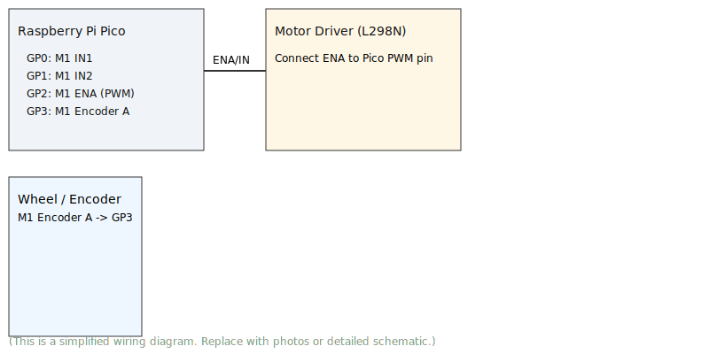

-----

# 🤖 3륜 옴니휠 로봇 속도 제어 시스템

<div align="center">
  
</div>

<p align="center">
  <strong>Raspberry Pi Pico와 MicroPython을 기반한 정밀 속도 제어 시스템</strong>
</p>

이 프로젝트는 Raspberry Pi Pico와 MicroPython을 사용하여 3륜 옴니휠 로봇(Kiwi Drive 방식)의 속도를 정밀하게 제어하는 것을 목표로 합니다. 엔코더 피드백과 P제어(비례 제어)를 통해 로봇이 목표 속도를 안정적으로 유지하도록 구현되었습니다.

-----

## 📑 목차

- [✅ 주요 특징](#-주요-특징)
- [📂 파일 구조](#-파일-구조)
- [⚙️ 하드웨어 구성](#️-하드웨어-구성)
- [🔌 핀 맵](#-핀-맵)
- [🚀 Getting Started](#-getting-started)
- [🕹️ 사용 방법](#️-사용-방법)
- [P 게인 튜닝](#2-p-게인-튜닝)
- [🔮 한계 및 개선 과제](#-한계-및-개선-과제)
- [📹 동작 영상](#-동작-영상)
- [🧾 라이선스](#-라이선스)
- [🤝 기여](#-기여)

-----

## ✅ 주요 특징

  * **P제어 기반 속도 유지**: 엔코더 피드백으로 각 바퀴의 현재 RPM을 실시간 측정하고, 목표 RPM과의 오차를 줄여나가는 P제어 로직을 구현했습니다.
  * **역기구학 (Inverse Kinematics)**: 로봇 전체의 목표 움직임(속도, 방향, 회전)을 각 바퀴가 회전해야 할 RPM으로 자동 변환합니다.
  * **듀얼 제어 인터페이스**: MRP3Mv4와 같이 `holonomic(방향, 속도)`과 `non_holonomic(X/Y축 속도)` 두 가지 방식으로 로봇에 명령을 내릴 수 있습니다.
  * **모듈화된 구조**: 하드웨어 제어(`Motor`, `Encoder`)와 로봇 전체 제어(`OmniRobot`)를 클래스로 분리하여 코드의 가독성과 재사용성을 높였습니다.

-----

## 📂 파일 구조

  * `📄 motor_controller.py`: `Motor`, `Encoder`, `OmniRobot` 클래스가 포함된 핵심 제어 파일입니다. 로봇의 모든 제어 로직이 여기에 있습니다.
  * `🚀 main.py`: `OmniRobot` 객체를 생성하고, 원하는 움직임을 명령하여 테스트하는 최종 실행 파일입니다.

-----

## ⚙️ 하드웨어 구성

### 주요 부품 목록

| 부품 종류 | 모델명 / 사양 |
| :--- | :--- |
| **MCU** | Raspberry Pi Pico |
| **모터** | GM37B-3322E (DC 12V, 1:30, 11PPR) |
| **모터 드라이버** | L298N Dual H-Bridge |
| **옴니휠** | 60mm Omni Wheel |
| **전원** | 12V Battery (e.g., Li-Po) |

### 로봇 기구학 정보 (Kinematics)

  * **구동 방식**: 3륜 옴니휠 (Kiwi Drive)
  * **휠 각도**: **M1(앞-왼): 330°, M2(뒤-중앙): 90°, M3(앞-오른): 210°**
  * **로봇 중심-바퀴 거리**: 0.1 m (100 mm)
  * **휠 지름**: 0.06 m (60 mm)

-----

## 🔌 핀 맵 (Pin Mapping)

| 기능 | M1 (앞-왼쪽) | M2 (뒤-중앙) | M3 (앞-오른쪽) |
| :--- | :---: | :---: | :---: |
| **PWM (ENA)** | `GP2` | `GP8` | `GP12` |
| **IN1** | `GP0` | `GP6` | `GP10` |
| **IN2** | `GP1` | `GP7` | `GP11` |
| **엔코더 A** | `GP3` | `GP9` | `GP13` |

-----

## � Getting Started (초기 설정)

1. **MicroPython 펌웨어 업로드**
   - Raspberry Pi Pico를 BOOTSEL 모드로 연결한 후 MicroPython UF2 파일을 복사하세요: https://micropython.org/download/rp2-pico/
2. **파일 배포**
   - `main.py`와 `lib/` 폴더를 Pico의 루트에 복사하세요(예: `ampy`, `rshell`, 또는 Thonny). 예: `ampy --port /dev/ttyACM0 put main.py`
3. **연결 확인**
   - 시리얼 콘솔(예: `screen /dev/ttyACM0 115200`)로 로그를 확인하세요.

### 로컬 시뮬레이터
- `tests/simulate.py`는 순수 Python에서 바로 동작하지 않을 수 있습니다. MicroPython 환경에서 실행하거나, `machine` 모듈을 모킹(Mock)한 후 실행하세요.

### 배선 (Wiring)

<div align="center">
  
</div>

<details>
<summary><strong>📌 배선 상세 정보</strong></summary>

| 모터 | PWM (ENA) | IN1 | IN2 | Encoder A |
|:----:|:---------:|:---:|:---:|:---------:|
| **M1** | GP2 | GP0 | GP1 | GP3 |
| **M2** | GP8 | GP6 | GP7 | GP9 |
| **M3** | GP12 | GP10 | GP11 | GP13 |

</details>

## �🕹️ 사용 방법

### 1\. 동작 설정 (`main.py`)

`main.py` 파일에서 `robot.holonomic()` 또는 `robot.non_holonomic()` 함수를 사용하여 로봇의 움직임을 설정합니다.

#### **`holonomic(speed, angle_deg, angular_velocity_dps)` 방식**

"방향과 속도"로 명령합니다.

  * `speed`: 로봇의 이동 속도 (m/s)
  * `angle_deg`: 로봇의 이동 방향 (각도)
      * `90`: 전진
      * `270`: 후진
      * `0`: 오른쪽 측면 이동
      * `180`: 왼쪽 측면 이동
  * `angular_velocity_dps`: 제자리 회전 속도 (deg/s, 양수: 반시계, 음수: 시계)

<!-- end list -->

```python
# 예시: 45도 대각선으로 0.2 m/s 속도로 이동
robot.holonomic(speed=0.2, angle_deg=45)
```

#### **`non_holonomic(vx, vy, angular_velocity_dps)` 방식**

"X축, Y축, 회전 속도"로 각각 명령합니다.

  * `vy`: 전후(Y축) 속도 (m/s, 양수: 전진)
  * `vx`: 좌우(X축) 속도 (m/s, 양수: 오른쪽)
  * `angular_velocity_dps`: 제자리 회전 속도 (deg/s)

<!-- end list -->

```python
# 예시: 전진(vy=0.2)하면서 동시에 오른쪽(vx=0.1)으로 이동
robot.non_holonomic(vx=0.1, vy=0.2, angular_velocity_dps=0)
```

### 2\. P 게인 튜닝 (`motor_controller.py`)

로봇의 반응이 너무 느리거나 심하게 떨릴 경우, \*\*`motor_controller.py`\*\*의 `kp` 값을 조절해야 합니다. **이 과정이 매우 중요합니다.**

```python
# motor_controller.py / OmniRobot 클래스 내부
self.kp = 10.0  # 권장 초기값: 10.0 — 낮은 값에서 시작해 점진적으로 증가시켜 안정성을 확인하세요.
```

**튜닝 권장 절차**:
1. 로봇을 고정(바퀴 공중)을 하고 소형 속도에서 테스트합니다.
2. `kp`를 낮은 값(예: 1 ~ 10)으로 시작해 천천히 올립니다.
3. 진동/소음/불안정성이 보이면 `kp`를 줄여 안정화합니다.
4. 실환경에서 거리·속도 테스트를 통해 최종 값을 결정합니다.

  * **`kp` 값이 너무 낮으면**: 로봇이 목표 속도에 도달하지 못하고 힘이 부족한 것처럼 보입니다. `T`(목표)값과 `C`(현재)값의 차이가 계속 클 것입니다.
  * **`kp` 값이 너무 높으면**: 로봇이 목표 속도를 중심으로 "드드드"하며 심하게 떨거나(진동), 모터에서 날카로운 소음이 발생할 수 있습니다.

-----

## 🔮 한계 및 개선 과제

  * **속도 제어 시스템**: 현재 코드는 **속도 제어**에 중점을 두고 있어, "정확히 50cm 이동"과 같은 **위치 제어**는 불가능합니다. 이를 위해서는 엔코더 값을 누적하여 현재 위치를 추정하는 **Odometry 로직**을 추가해야 합니다.
  * **단일 채널 엔코더**: 현재 방향 추정 방식은 오버슈트나 외부 힘에 의한 역회전을 감지하지 못해 위치 추정 시 오차가 누적될 수 있습니다. 듀얼 채널(A/B상) 엔코더를 사용하면 이 문제를 해결할 수 있습니다.

---

## � 동작 영상

<div align="center">
  
[](assets/video/_talkv_wyuEkOearh_6kskM2hgC7MM4l6HgnPXjk_talkv_high.mp4)

<video src="assets/video/_talkv_wyuEkOearh_6kskM2hgC7MM4l6HgnPXjk_talkv_high.mp4" width="480" controls></video>

<p><sub>실제 로봇 구동 영상 (MP4)</sub></p>

</div>

-----

## ⚙️ 자동 로깅 & 튜닝 (호스트에서 시뮬레이션)
- `tools/logging_sim.py`는 MicroPython 환경이 없어도 로봇 동작을 간단히 시뮬레이션하고 CSV 로그를 생성합니다.
- 사용 예: `python3 tools/logging_sim.py --duration 10 --dt 0.02 --out logs/tuning.csv`
- `matplotlib`가 설치되어 있으면 자동으로 `.png` 플롯도 생성합니다.

**A/B 엔코더 예제**: `examples/ab_encoder_example.py`를 참고하세요. 하드웨어에서 A/B 엔코더가 있다면 `Encoder(pin_a, pin_b)`로 생성해 `robot.encoders`에 할당하세요.

## 🧾 라이선스
이 프로젝트는 기본적으로 **MIT License**를 사용합니다. 자세한 내용은 `LICENSE` 파일을 확인하세요.

## 🤝 기여
기여 가이드는 `CONTRIBUTING.md`를 참조하세요. 버그 리포트·기능 제안·PR 모두 환영합니다.
